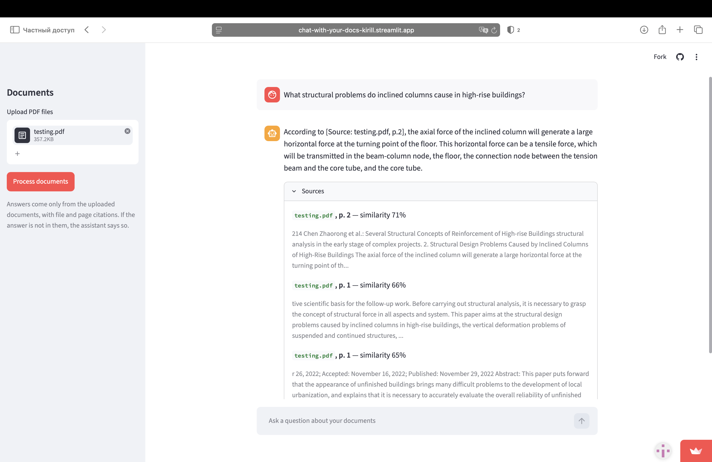
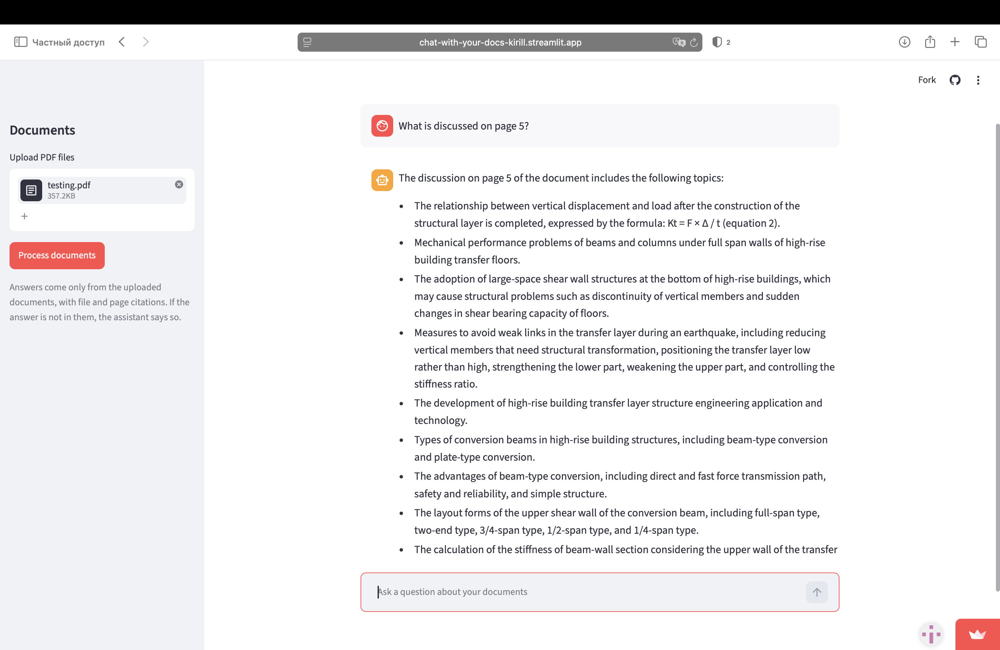
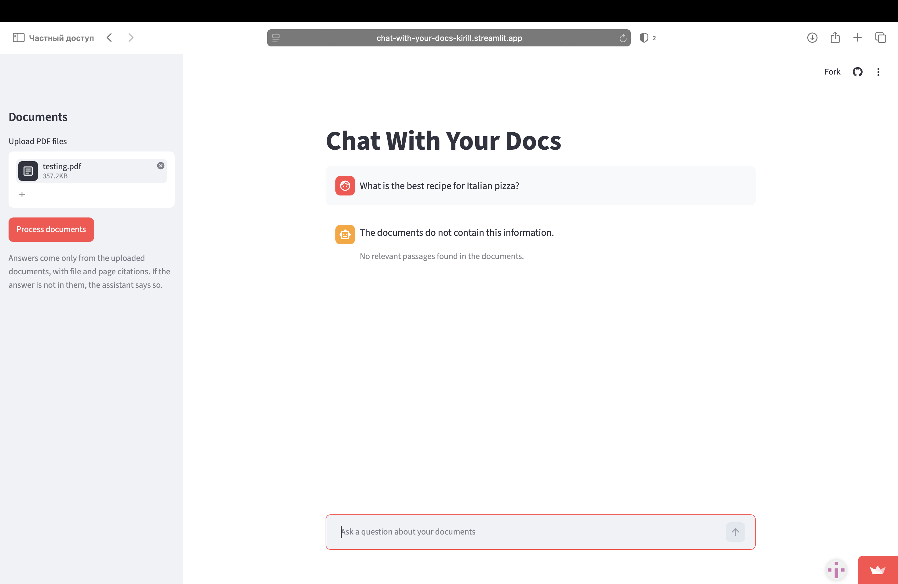

# Chat-With-Your-Docs

A Retrieval-Augmented Generation (RAG) app that answers questions strictly from your own
PDFs and cites its sources (file and page). Local embeddings + ChromaDB + Groq LLM,
wrapped in a Streamlit chat and deployed to a live public URL.

**Live demo:** [chat-with-your-docs-kirill.streamlit.app](https://chat-with-your-docs-kirill.streamlit.app)


Retrieval quality here is **measured, not assumed**: hit-rate on a labelled question set,
per-stage latency, a chunk-size experiment, and an embedding-model comparison — all
reproducible from [notebooks/01_experiments.ipynb](notebooks/01_experiments.ipynb)
(committed with outputs) and [eval/run_eval.py](eval/run_eval.py).

## Screenshots

**Grounded answer with sources** — every answer cites file + page and shows the exact
passages it was built from, with similarity scores:



**Query routing** — "what is on page N" is a structural question, answered from that
page's chunks directly (metadata filter) instead of semantic search:



**Honest refusal** — when the answer is not in the documents, the assistant says so
instead of inventing one:



## Overview

### The problem RAG solves

A large language model answers from its training memory: it has never seen your documents,
and when it does not know an answer it tends to invent a plausible one (hallucination).
RAG fixes both. Before the model answers, the app finds the passages of *your* documents
relevant to the question, pastes them into the prompt, and instructs the model to answer
using only that text — and to say so when the answer is not there. Instead of a student
answering an exam from memory, the same student opens the textbook to the right page first.

### How it works (6 steps)

1. **Chunk** — split each PDF into overlapping ~800-character pieces (tuned by experiment,
   see Results). Overlap prevents cutting a thought in half at a boundary.
2. **Embed** — turn each chunk into a 384-dim vector that captures its meaning
   (`all-MiniLM-L6-v2`, running locally on CPU).
3. **Store** — save vector + chunk text + metadata (file, page) in ChromaDB, persisted on disk.
4. **Retrieve** — embed the question with the *same* model, take the top-5 nearest chunks
   by cosine similarity.
5. **Augment** — build the prompt: instructions + retrieved passages labelled with their
   sources + the question.
6. **Generate** — the LLM (Llama 3.1 via Groq API) answers only from that context; the
   source list under the answer comes from retrieval metadata, not from the model's text,
   so citations cannot be hallucinated.

### Two details that came from testing, not from a tutorial

- **Query routing.** "What is on page 5?" is a *structural* question — semantic search
  cannot answer it (embeddings encode content, not document structure). The app detects
  page references and fetches that page's chunks directly via a metadata filter instead
  of vector search.
- **Two-layer defense against off-topic questions.** A relevance floor (similarity 0.25)
  filters out noise like small talk before it reaches the LLM. Measurement showed it does
  NOT catch on-topic questions whose answer is absent (they score 0.45+ on similarity —
  topical closeness is not answer presence), so the grounding prompt handles that second
  case. Each layer catches what the other misses; see Error Analysis.

## Results

Evaluation set: 11 labelled questions over an 8-page English engineering article —
6 direct (wording close to the text), 3 paraphrased (different wording, same meaning),
2 unanswerable (on-topic, but the answer is not in the document). Expected source page
is labelled for each answerable question. Metric: **hit-rate@k** — is the expected page
among the top-k retrieved chunks?

### Retrieval accuracy

| Question type | n | hit@1 | hit@3 | hit@5 |
|---|---|---|---|---|
| direct | 6 | 5/6 | 6/6 | 6/6 |
| paraphrased | 3 | 3/3 | 3/3 | 3/3 |
| **all** | **9** | **8/9** | **9/9** | **9/9** |

Every question resolves within top-3; top-5 adds safety margin.

### Latency (median per stage)

| Stage | Median |
|---|---|
| Query embedding (local CPU) | ~30 ms |
| Vector search (ChromaDB, 50 chunks) | ~1 ms |
| LLM call (Groq API) | ~1600 ms |
| **Total** | **~1630 ms** |

The LLM call is ~98% of response time; retrieval is effectively free at this corpus size.
Reproduce with `python -m eval.run_eval --llm`.

### Chunk-size experiment

| Chunk size | Chunks | hit@1 | hit@3 |
|---|---|---|---|
| 400 chars | 114 | 0.89 | 1.00 |
| **800 chars (chosen)** | **50** | **0.89** | **1.00** |
| 1500 chars | 27 | 0.67 | 1.00 |

Large chunks blur the embedding (several topics average into one vector) and lose the
top-1 spot. 800 ties 400 on accuracy with 2.3× fewer vectors and fuller context per
retrieved chunk. Caveat: with 9 questions, one hit = 0.11 — single-hit differences are
directional, not significant.

### Embedding model comparison

| Model | Params | Size | hit@1 | hit@3 |
|---|---|---|---|---|
| **all-MiniLM-L6-v2 (chosen)** | 22.7M | ~91 MB | 0.89 | 1.00 |
| paraphrase-multilingual-MiniLM-L12-v2 | 117.7M | ~471 MB | 0.89 | 1.00 |

Identical retrieval quality on an English corpus; the multilingual model costs 5.2× the
memory — decisive when the deploy target is a free cloud container (~2.7 GB RAM). For a
mixed-language corpus the multilingual model would be the rational default: its language
coverage cost no measured accuracy on English.

## Error Analysis

Observed failure modes, from live testing and the eval set:

- **Meta-questions about document structure.** "What is the title of the first page?"
  scores ~0.1 similarity against every chunk — embeddings encode content meaning, not
  structure. Page-reference routing covers the "page N" family; titles, authorship and
  page counts remain semantic-search blind spots.
- **Similarity measures topical closeness, not answer presence.** On-topic questions with
  no answer in the document ("average construction cost per m²...") retrieve chunks at
  0.45+ similarity. The relevance floor cannot reject them; the grounding prompt provides
  the refusal. Verified: both unanswerable eval questions get a clean "the documents do
  not contain this information".
- **Phrasing sensitivity at the refusal boundary.** An emphatic double "how?" flipped an
  answerable question into a refusal: the strict grounding prompt raised the bar for what
  counts as an answer. Fixed by an explicit partial-answer rule in the prompt ("answer
  with what is available and state what is missing"). Anti-hallucination strictness and
  false refusals trade off exactly like precision and recall.
- **Only the text layer exists.** Figures, diagrams and scanned images are invisible to
  the pipeline; a question answered only by a picture cannot be retrieved. Figure captions
  (text) are indexed.
- **Page routing does not disambiguate files.** With several PDFs uploaded, "what is on
  page 2?" returns page 2 of every document. A file-aware router (detecting the filename
  in the question) is a natural next step.
- **One shared index per deployment.** All visitors of the demo search the same
  collection: documents stay searchable until someone presses "Clear all documents".
  Fine for a demo; a multi-user product would scope the index per session.
- **Small evaluation set.** 11 questions on one document — results are directional. The
  protocol (labelled expected sources, hit-rate@k, per-stage timing) scales to a larger
  corpus unchanged.
- **Ephemeral storage on the free host.** The cloud container's disk resets on restart;
  uploaded documents must be re-uploaded after the app sleeps. Local runs persist.

## Tech Stack

| Layer | Choice | Why |
|---|---|---|
| PDF parsing | PyMuPDF | extracts text per page — page numbers are required for citations |
| Embeddings | sentence-transformers, `all-MiniLM-L6-v2` | local and free; wins the measured size/quality tradeoff above |
| Vector DB | ChromaDB | zero infrastructure, stores vector + text + metadata together, persists out of the box |
| LLM | Groq API (Llama 3.1 8B) | free tier, fast inference; one call per question |
| UI | Streamlit | chat + file upload in pure Python; free cloud hosting |

**Cost design:** the bulk work (embedding every chunk of every document) runs locally at
zero cost; only the light per-question work (one LLM call) goes through an external API.

## Project Structure

```
├── src/
│   ├── ingest.py       # parse PDF -> chunk -> embed -> ChromaDB (replace-on-reingest)
│   ├── retrieve.py     # embed query -> top-k similar chunks + page-reference routing
│   ├── generate.py     # grounded prompt -> Groq LLM -> answer + sources from metadata
│   └── config.py       # all tunables: models, chunk size, top-k, relevance floor
├── eval/
│   ├── questions.json  # labelled eval set: direct / paraphrased / unanswerable
│   └── run_eval.py     # hit-rate@k, relevance-floor check, per-stage latency
├── notebooks/
│   └── 01_experiments.ipynb  # chunk-size + embedding-model experiments, with outputs
├── data/
│   └── testing.pdf     # eval corpus (published journal article) — keeps eval reproducible
├── screenshots/        # README images + demo GIF
├── app.py              # Streamlit chat UI
├── requirements.txt    # pinned dependencies
└── .env.example        # required env vars (no real keys)
```

## Getting Started

```bash
git clone https://github.com/Kirill-ark/Chat-With-Your-Docs.git
cd Chat-With-Your-Docs
python3.12 -m venv .venv && source .venv/bin/activate
pip install -r requirements.txt

cp .env.example .env    # then put your Groq API key into .env

streamlit run app.py
```

Upload a PDF in the sidebar, press "Process documents", ask questions. Answers cite
file + page and show similarity scores per source.

Reproduce the evaluation (the labelled corpus `data/testing.pdf` ships with the repo):

```bash
python -m src.ingest data/testing.pdf
python -m eval.run_eval          # add --llm to also time the LLM stage
```

To re-run the experiments notebook: `pip install jupyter`, then open
`notebooks/01_experiments.ipynb` and Run All.

### Deployment

Deployed on Streamlit Community Cloud from this repo: the API key is set as a hosting
secret (never in git), Python 3.12, auto-redeploys on push.
